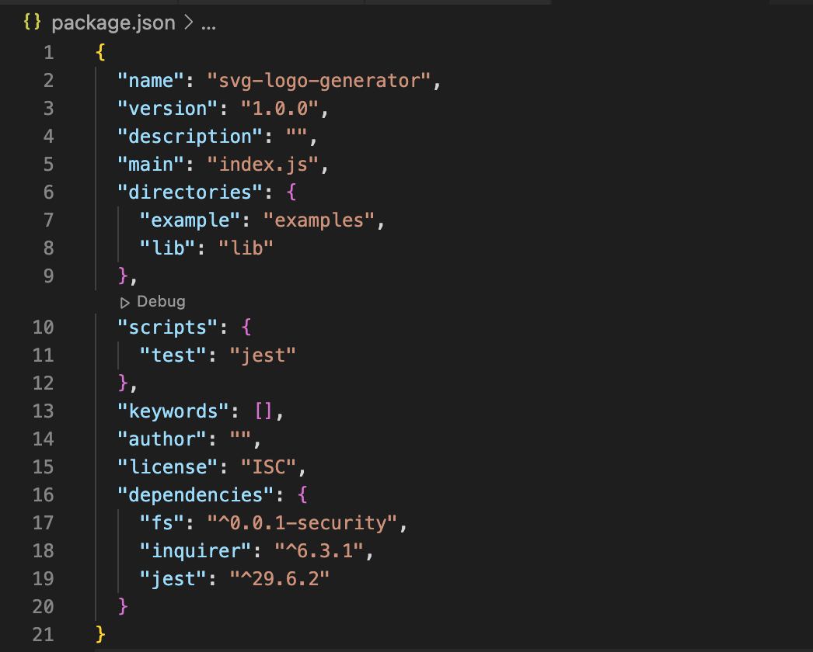

# SVG Logo Generator

## Description

This project is designed to allow business developers and entrepreneurs to create a custom SVG logo, specialized to their needs. The background, shape, and text are all able designed with any availible hexadecimal or keyword color value available in CSS. Following the design formatting, the text is limited to three characters, intended for abbreviations. In this early development, the shapes are limited to circle, square, and triangle. For clarification, the `forTest.js` file is an exact copy of `index.js` without the function call at the end of the file, as it is used in the tests to ensure the program functions without error. Check out some designs created by this generator in the examples folder.

## Table of Contents 

- [Installation](#installation)
- [Usage](#usage)
- [Credits](#credits)
- [License](#license)
- [Badges](#badges)
- [Tests](#tests)
- [Questions](#questions)

## Installation

In order to get the environment to run, the user will need to install a couple vital packages, being fs, inquirer, and jest. Please ensure that version 6.3.1 of inquirer is installed, as well as version 29.6.2 of jest is installed. Importantly the user will need to begin with the command `npm init`, followed by `npm install inquirer@6.3.1` and `npm install jest@29.6.2`. 

## Usage

First, the user should open an integrated termianl associated with this repository file. If the installation process is completed, the user needs to type in the command `node index`. The user will then be prompted with five questions in the terminal. The user will be promtped for text (up to three characters), a shape to choose from, and for the color of the text, main shape, and background. Importantly, please note that the user can either type in a color keyword or a six-digit hexadecimal value. Do not worry about whether the user should use a `#` or not because either way, the program will handle the value and ensure the color is registered as `#******`. The following video will also provide a user-friendly tutorial and show the various ways to input color.

[Tutorial](https://watch.screencastify.com/v/qhwqU9ufD7AKsV6EiIIj)

## Credits

David Montoto

## License

[Unlicensed](LICENSE)

## Badges

## Tests

For this SVG logo generator, there are a total of 23 individal tests contained within the `shape.test.js` file. This file tests the parent class, shape, as well as all three shape classes which are circle, square, and triangle. For the tests that check whether the input parameters are valid or now, the `forTest.js` file is used, which is exactly the same as the `index.js` file. The reason for this second file is to prevent the user from being prompted in their own terminal after running the tests that mock console implementation. To run these tests, please open an integrated terminal for the `lib` folder and run `npm test`. Feel free to add additional tests at the user's own discretion.

## Questions

For more information, check out my page: [Github](https://github.com/dmmontoto)

For additional questions, please reach me at my email: david_montoto@icloud.com 